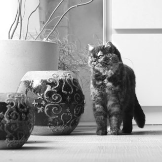

Use CSS3 Gradients to Create Placeholders for Images
====================================================

A typical issue on social platforms with galleries—Too few pictures for the design:

  
  
  

You can either leave the space white, or add empty divs as placeholders.
While the first solution is fine, the second one feels like a bit of a dirty solution
Alternatively, the gallery element could have a background image which may result in another HTTP request.

CSS3 gradients are handled just like normal background images.
There’s no written law that requires the starting color to differ from the ending color,
so gradients can generate non-gradient backgrounds.
In combination with `background-size` and `background-position` this can be used to generate image placeholders.

Step 1: Add a Background “Gradient”
-----------------------------------

I removed all images and added a plain background:

    ## css ##
    .step-1 {
      background: linear-gradient(#DBE0DF, #DBE0DF);
    }

Step 2: Setting the Size
------------------------

With `background-size` I limit the size of the “gradient” to the size of an image (156px).
To not let it cover everything like in the first step, the background must be `no-repeat`.

    ## css ##
    .step-2 {
      background: linear-gradient(#DBE0DF, #DBE0DF) no-repeat;
      background-size: 156px 156px;
    }

Step 3: Position the Gradient
-----------------------------

To use the same padding for the background placeholders, the background-origin is useful:

    ## css ##
    .step-3 {
      background: linear-gradient(#DBE0DF, #DBE0DF) no-repeat;
      background-size: 156px 156px;
      background-origin: content-box;
    }

Step 4: Repeat It
-----------------

Instead of `repeat`, use `space`.
This is like `text-align: justify` for background images.

    ## css ##
    .step-4 {
      background: linear-gradient(#DBE0DF, #DBE0DF) space;
      background-size: 156px 156px;
      background-origin: content-box;
    }

Perfect, right?
You’re using Chrome, right?
Let’s step back from the future.

Step 5: Repeat It (2nd Try)
---------------------------

An alternative solution comes in the form of multiple background images,
which can be multiple gradients.
We have to position each of them by hand.

    ## css ##
    .step-5 {
      background: linear-gradient(#DBE0DF, #DBE0DF) 0 0,
                  linear-gradient(#DBE0DF, #DBE0DF) 166px 0,
                  linear-gradient(#DBE0DF, #DBE0DF) 332px 0,
                  linear-gradient(#DBE0DF, #DBE0DF) 498px 0,
                  linear-gradient(#DBE0DF, #DBE0DF) 664px 0;
      background-repeat: no-repeat;
      background-size: 156px 156px;
      background-origin: content-box;
    }

Now it’s perfect in most browsers.
Old browsers will just get a transparent background.
As this is just a placeholder, which for me is OK compared to the time spent on creating images and slowing down the website.

But the code still looks ugly, so let’s use Sass.

Step 6: Don’t Repeat Yourself
-----------------------------

    ## css ##
    @function background-placeholder-images($color, $size, $gap, $count) {
      $result: ();
      @for $i from 1 through $count {
        $x: ($gap + $size) * ($i - 1);
        $result: append($result, linear-gradient($color, $color) $x 0, comma);
      }
      @return $result;
    }

    @mixin background-placeholders($color, $size, $gap, $count) {
      background: background-placeholder-images($color, $size, $gap, $count);
      background-repeat: no-repeat;
      background-size: $size $size;
      background-origin: content-box;
    }

    .step-6 {
      @include background-placeholders($color: #DBE0DF, $size: 156px, $gap: 10px, $count: 5);
    }

Finally, a reusable automated solution.
I’ve been using a more complex (different image sizes) example in [Homify’s living style guide](http://www.homify.de/assets/styleguide.html#projects).

