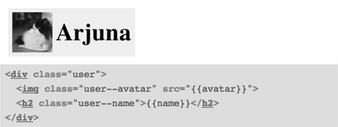
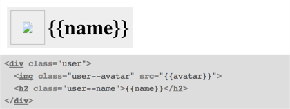

Using Handlebars.js Templates in the Living Style Guide
=======================================================

When using front-end style guides, many examples look very similar to the templates (e. g. Handlebars.js templates).
To keep things simple and DRY, we want to share them between the JavaScript application and the style guide.

I build my “static” websites I build by using [Middleman](http://middlemanapp.com).
CSS is generated by Sass.
Style guides are written using Markdown and the [LivingStyleGuide gem](http://livingstyleguide.org).


Project Structure
-----------------

* project/
  * source/
    * css/
      * components/
        _*.scss
        _*.md
      * styles.css.scss
      * styleguide.html.lsg
    * templates/
      * _*.hbs
    * javascripts/
      * handlebars-v1.3.0.js
    * index.html.erb
  * config.rb

(simplified)


Saving the Templates
--------------------

I save all Handlebars.js templates in *source/templates/*.
They start with an underscore—Middleman should not build them.
For example:

    ## html ##
    # source/templates/_user.hbs:
    <div class="user">
      
      <h2 class="user--name">{{name}}</h2>
    </div>


Including Templates for JavaScript
----------------------------------

In addition to other possible options, including templates as `<script>` tags in the main HTML file is a solution:

    ## html ##
    # source/index.html.erb
    <html>
      <body>
        <⁣% Dir.glob('source/templates/*') do |file| %⁣>
          <⁣% id = file.gsub(/.+\/_(.+?)\..+$/, '\\1') %⁣>
          <script id="<⁣%= id %⁣>" type="text/x-handlebars-template">
            <⁣%= File.read(file) %⁣>
          </script>
        <⁣% end %⁣>
      </body>
    </html>

This will create a `<script>` tag for each template file and use the filename without underscore and extension as ID.


Creating an Example in the Style Guide
--------------------------------------

Usually we create an example for our *user* component with Sass code in *source/css/components/_user.scss*.
For example, like this:

    ## markdown ##
    #source/css/components/_user.md:
    User
    ====

    ```
    <div class="user">
      
      <h2 class="user--name">Arjuna</h2>
    </div>
    ```

This will look good, but it’s practically duplicate content:




Loading the Example from Handlebars
-----------------------------------

In the example we just want to link to the template.
The LivingStyleGuide has an API to add filters with options prefixed by an `@` within the examples:

    ## markdown ##
    User
    ====

    ```
    @handlebars user
    ```

To let this work, we need to extend the LivingStyleGuide:

    ## ruby ##
    # config.rb:
    LivingStyleGuide::Example.add_filter :handlebars do |template_id|
      begin
        # Set up the syntax highlighter:
        @syntax = :html

        pre_processor do
          # use the contents of the file as the source of the example:
          @source = File.read(File.join(%W(source templates _#{template_id}.html)))
        end

      end
    end

We use the same source, but the output became ugly because of the `{{placeholders}}`—which especially for the `src` is not acceptable.




Adding JSON Data to Fill the Template
-------------------------------------

As we are loading the template from the file, the actual example does not have any content anymore.
We can add JSON data here:

    ## markdown ##
    User
    ====

    ```
    @handlebars user
    {
      "avatar": "arjuna.jpg",
      "name": "Arjuna"
    }
    ```

Now it gets slightly more complicated.
To render Handlebars.js, we need JavaScript.
It’s possible to do this on the server side, but it’s easier to do so in the browser:

    ## ruby ##
    # config.rb:
    LivingStyleGuide::Example.add_filter :handlebars do |template_id|
      begin
        # set up the syntax highlighter:
        @syntax = :html

        # the pre_processor takes the content of the example as first argument:
        pre_processor do |json|
          # use the contents of the file as the source of the example:
          handlebars = File.read(File.join(%W(source templates _#{template_id}.hbs)))
          @source = handlebars.clone

          # escape JavaScript:
          handlebars.gsub! /\n/, '\\n'
          handlebars.gsub! /'/, '"'

          # compile and render the template and direclty write it into the document:
          %Q(<script>document.write(Handlebars.compile('#{handlebars}')(#{json}));</script>)
        end

      end
    end

Now we just need to link the Handlebars.js file.
That’s just an option in the LivingStyleGuide (if you already added the file in the project):

    ## yaml ##
    # source/css/styleguide.html.lsg
    javascript-before:
      - /javascripts/handlebars-v1.3.0.js


Conclusion
----------

With some configuration it’s possible to share Handlebars.js templates with the front-end style guide.
It should be possible to adopt this to other template engines.
When I’m done with more testing on example projects, I’m going to integrate this into the LivingStyleGuide gem.
[Issue #64](https://github.com/hagenburger/livingstyleguide/issues/64) is already opened.


<style type="text/scss">
.post h1 {
  padding-top: 160px;

  &:before {
    content: url("2014-04-29/background.svg");
    margin: -160px 0 0 300px;
    position: absolute;
  }
}
</style>


